| Codes | Output |
|-------|--------|
|['q1.sh'](./Codes/q1.sh)| 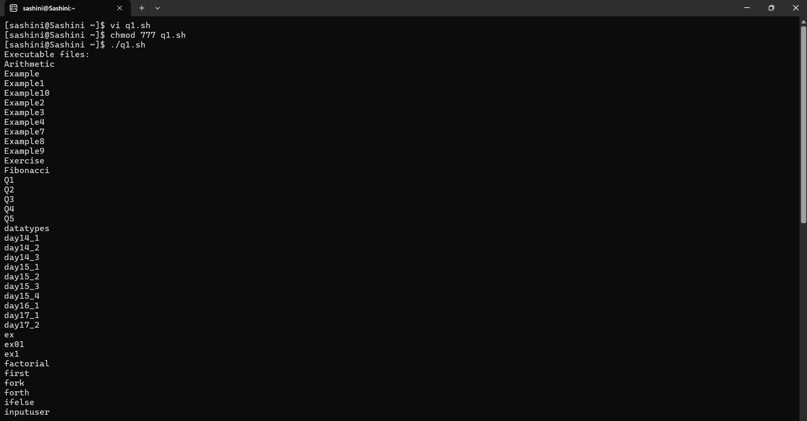 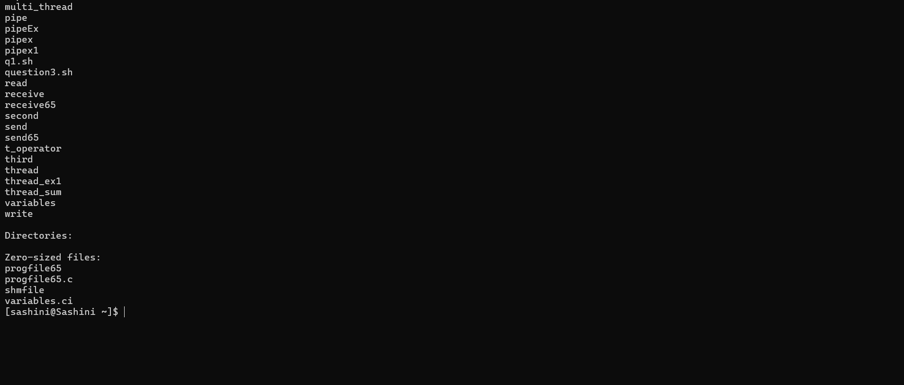|
|['q2.sh'](./Codes/q2.sh)| 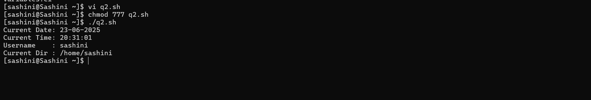|
|['q3.sh'](./Codes/q3.sh)| 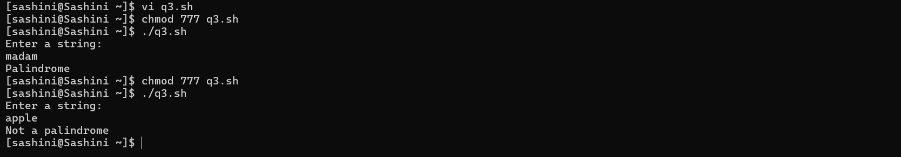|
|['q4.sh'](./Codes/q4.sh)| 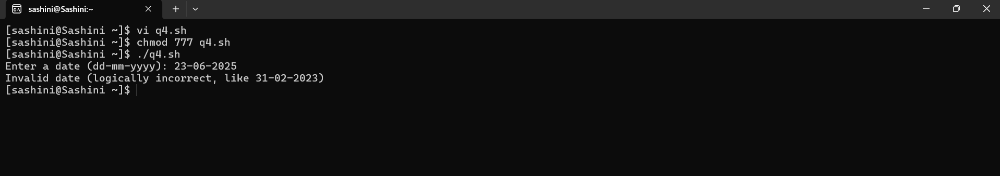|
|['q5.sh'](./Codes/q5.sh)| 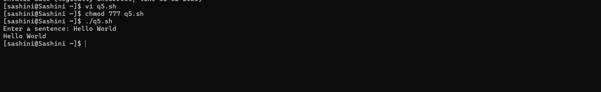|
|['q6.sh'](./Codes/q6.sh)| 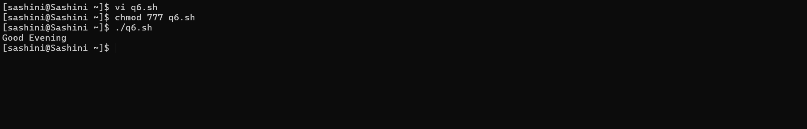|
|['q8.sh'](./Codes/q8.sh)| 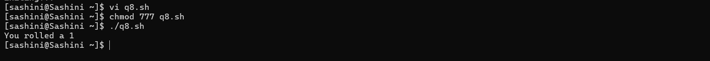|
|['q9.sh'](./Codes/q9.sh)| 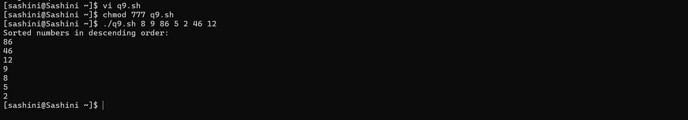|
|['q10.sh'](./Codes/q10.sh)| 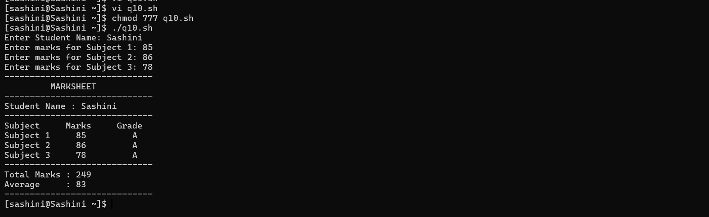|
|['q11.sh'](./Codes/q11.sh)| 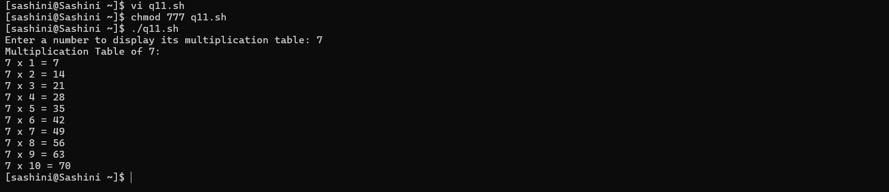|
|['q12.sh'](./Codes/q12.sh)| 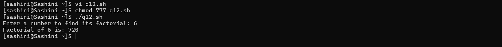|
|['q13.sh'](./Codes/q13.sh)| 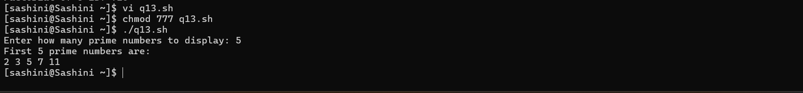|

